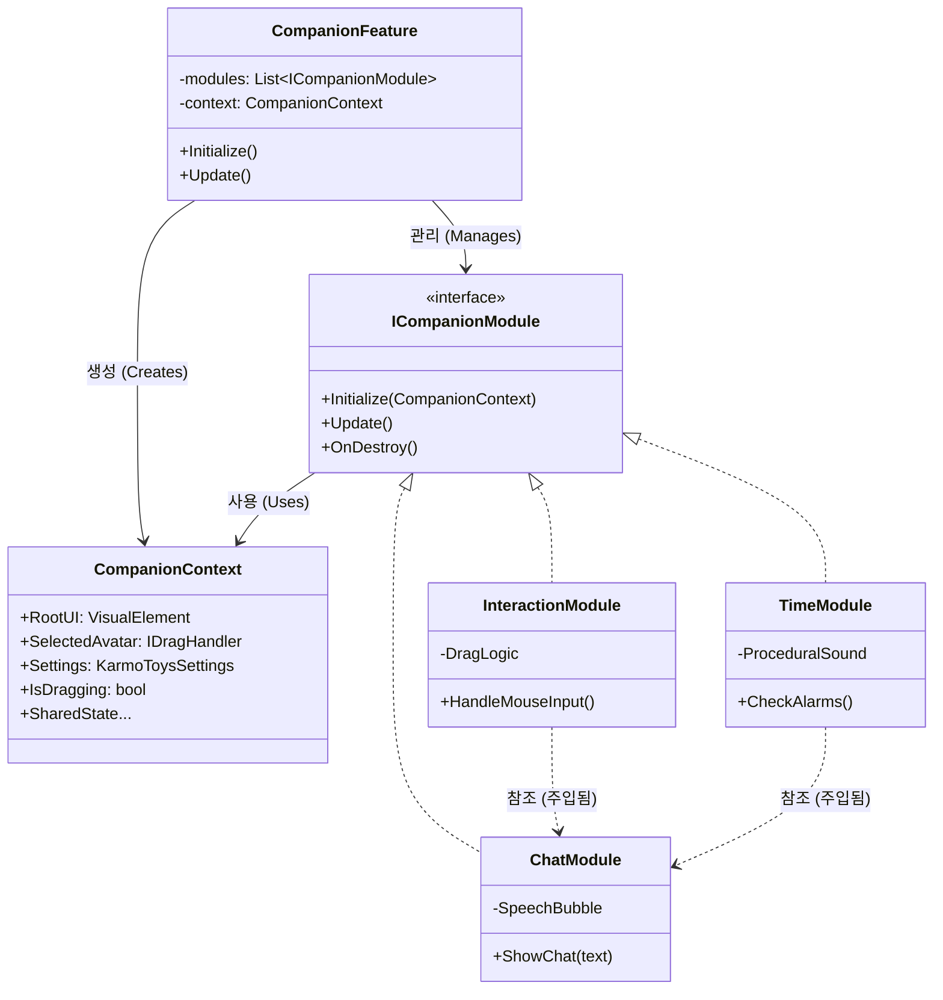

# Companion Feature Architecture

Summary: Companion 기능의 모듈형 아키텍처 설계 문서. Coordinator-Module 패턴을 통해 입력, 채팅, 시간 관리 등의 기능을 독립된 모듈로 분리하여 확장성과 유지보수성을 확보함.

> **작성일**: 2026-01-19
> **버전**: 2.0 (Modular Update)

## 1. 개요 (Overview)

**Companion Feature**는 확장성과 유지보수성을 위해 모듈형 아키텍처로 리팩토링됨. 기존의 거대한 `CompanionFeature.cs`가 모든 것(입력, 채팅, 렌더링, 로직)을 처리하던 방식에서 벗어나, 역할별로 특화된 **모듈(Modules)**로 분리함.

## 2. 핵심 컴포넌트 (Core Components)

### 🏗️ 구조 (Structure)

**Coordinator(조정자) - Module(모듈)** 패턴을 따름.

### 🔑 주요 클래스 (Key Classes)

1. **CompanionFeature (조정자)**
    * **역할**: 진입점. `CompanionContext`를 생성하고 등록된 모듈들의 수명 주기(`Initialize`, `Update`, `Destroy`)를 관리함.
    * **책임**:
        * 투명 윈도우 설정 (플랫폼별).
        * 모듈 생성 및 연결(DI).
        * 창 최상단 유지(Always On Top) 처리.

2. **CompanionContext (공유 상태)**
    * **역할**: 초기화 시 모든 모듈에 전달되는 데이터 컨테이너(DTO).
    * **데이터**: Root UI, 선택된 아바타, 전역 설정(Settings), `IsDragging` 같은 공유 플래그를 담음.

3. **Modules (모듈)**
    * **InteractionModule**: 사용자 입력(Win32/Unity Input 마우스 폴링), 드래그 & 드롭 로직, 설정 패널 UI 담당.
    * **ChatModule**: `SpeechBubbleElement` 관리, `CompanionTalkData` 로드, 자동 채팅 스케줄링 담당.
    * **TimeModule**: 매 초 시간 체크, `CompanionAlarmData` 처리, 알람 트리거(메시지 + 사운드) 담당.

## 3. 데이터 흐름 (Data Flow)

1. **초기화 (Initialization)**:
    * `CompanionFeature` 실행.
    * UI 및 설정 참조를 담은 `CompanionContext` 생성.
    * 모듈 인스턴스 생성 (`Chat`, `Interaction`, `Time`).
    * **의존성 주입 (Dependency Injection)** 수행 (예: `TimeModule`은 말하기 위해 `ChatModule`이 필요함).
    * 각 모듈의 `Initialize(context)` 호출.

2. **업데이트 루프 (Update Loop)**:
    * `CompanionFeature.Update()`가 모든 모듈의 `module.Update()`를 순차 호출함.
    * **InteractionModule**: 마우스 위치 폴링 → `WindowTransparencyUtils` 사용.
    * **TimeModule**: 시스템 시간 vs `Alarms` 리스트 비교.
    * **ChatModule**: 말풍선 위치 업데이트 (아바타 머리 위).

3. **모듈 간 통신 (Cross-Module Communication)**:
    * 모듈 간 통신은 주로 **직접 참조(설정 시 주입됨)** 또는 **공유 컨텍스트**를 통해 이루어짐.
    * 예시: `TimeModule`이 알람을 울릴 때 `_chatModule.ShowChat()`을 직접 호출함.

## 4. 향후 확장 (Future Extensions)

* **IdleMonitorModule**: 사용자 입력 부재를 감지하여 아바타를 '수면' 모드로 전환.
* **WeatherModule**: 날씨 API 연동 및 관련 대사/아이콘 표시.
* **MusicModule**: 배경 음악 또는 라디오 재생.
