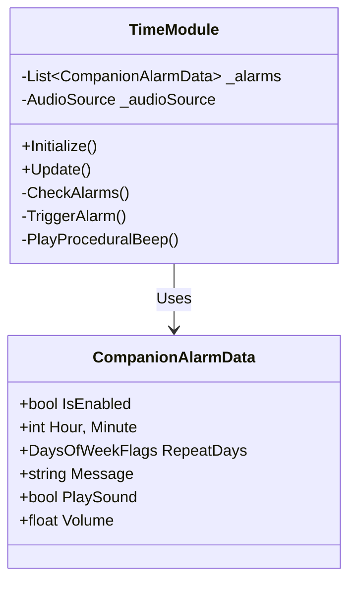

# Time Module Documentation

Summary: 컴패니언의 시간 관리 기능을 담당하는 모듈. 알람, 타이머, 정각 알림 등 시간 기반 이벤트를 관장하고 절차적 사운드 생성을 통해 피드백을 제공함.

> **작성일**: 2026-01-19
> **담당 모듈**: `KarmoToys.Features.Companion.Modules.TimeModule`

## 1. 개요 (Overview)

**TimeModule**은 컴패니언의 시간 관리 기능을 담당하는 핵심 모듈임. 단순히 시간을 확인하는 것을 넘어, 알람(Alarm), 타이머(Timer), 정각 알림(Chime) 등 시간 기반의 모든 이벤트를 관장하고 적절한 피드백(대사, 사운드)을 트리거함.

## 2. 주요 기능 (Key Features)

### 2.1. 스마트 알람 (Smart Alarm)

* **데이터 구조**: `CompanionAlarmData` (ScriptableObject 내 `Alarms` 리스트로 관리).
* **반복 알람**: `DaysOfWeekFlags` 비트 플래그를 사용하여 요일별 반복(예: 월/수/금)을 효율적으로 처리.
* **정밀도**: 매 프레임 체크하지 않고, `1.0초` 간격으로 폴링하여 성능 부하를 최소화함.
* **중복 방지**: 같은 분(Minute)에 알람이 여러 번 울리지 않도록 `_lastTriggeredMinute` 플래그로 래칭(Latching) 처리.

### 2.2. 절차적 사운드 (Procedural Sound)

* **오디오 파일 프리(Asset-Free)**: 별도의 `.wav`, `.mp3` 파일 없이 코드로 소리를 만들어냄.
* **구현 원리**:
  * 런타임에 `AudioClip.Create`를 사용하여 클립 생성.
  * `Mathf.Sin` 함수로 **1000Hz Sine Wave** 파형 데이터를 직접 작성.
  * `AudioSource`를 동적으로 생성(`new GameObject("CompanionAudio")`)하여 재생.
* **볼륨 제어**: 데이터의 `Volume` (0.0 ~ 1.0) 값을 `AudioSource.PlayOneShot` 인자로 전달하여 즉각적인 볼륨 조절 가능.

## 3. 기술 상세 (Technical Details)

### 3.1. 클래스 구조

### 3.2. 알람 체크 로직 (Flow)

1. **Update Loop**: `Time.deltaTime` 누적하여 1초 경과 확인.
2. **Time Check**: 현재 시스템 시간(`DateTime.Now`)의 시/분 추출.
3. **Latch Check**: 이미 처리한 분(Minute)이면 스킵.
4. **Iterate Alarms**:
    * 활성화(`IsEnabled`) 여부 확인.
    * 시간 일치(Hour, Minute) 확인.
    * 요일 일치(`RepeatDays & CurrentDay`) 확인.
5. **Trigger**:
    * `ChatModule.ShowChat(Message)` 호출.
    * `PlayProceduralBeep(Volume)` 호출.
    * (일회성 알람인 경우) `IsEnabled = false` 처리.

## 4. 설정 방법 (How to Configure)

1. 유니티 에디터에서 `CompanionTalkData.asset` 선택.
2. **Clock & Utility** 섹션의 `Alarms` 리스트 확장.
3. **+** 버튼으로 새 알람 추가.
    * **Time**: 시(0-23), 분(0-59) 설정.
    * **Repeat**: 반복 요일 선택 (기본: 평일).
    * **Sound**: `Play Sound` 체크 및 볼륨 슬라이더 조절.
4. Play Mode에서 테스트.

## 5. 향후 계획 (Roadmap)

* **타이머(Timer)**: "3분 뒤에 알려줘" 기능 (동적 카운트다운).
* **스톱워치(Stopwatch)**: 경과 시간 측정 및 기록.
* **사용자 오디오**: 비프음 대신 사용자가 지정한 `.mp3` 파일 재생 지원.
