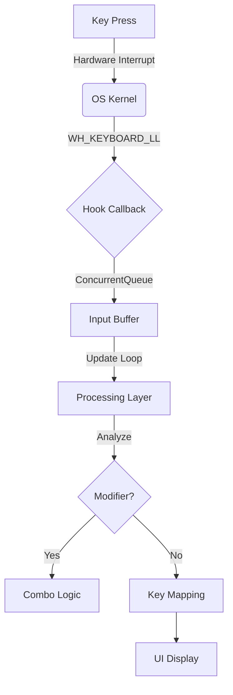
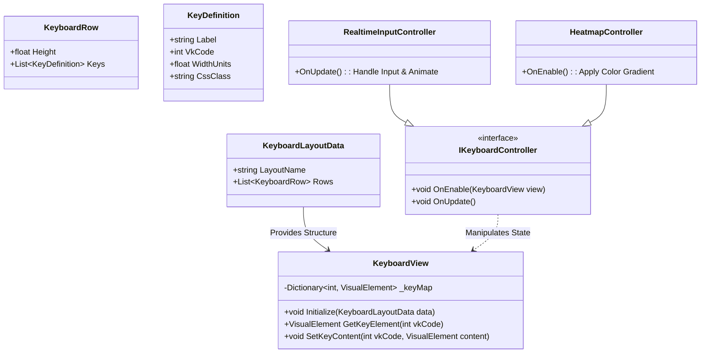
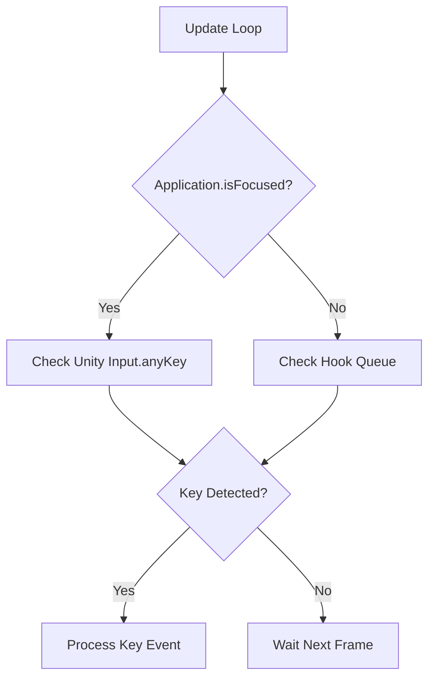

# Companion Keyboard Module Technical Guide

Summary: KarmoLab 컴패니언의 키보드 기능에 대한 통합 기술 문서, 시각화 시스템(EKLS) 설계 및 기술적 심층 분석(Deep Dive) 포함.

## 🎯 개요 (Introduction)

KarmoLab 컴패니언의 **Keyboard Module**은 단순한 입력 감지를 넘어, 키보드를 하나의 데이터 소스로 활용하여 시각화(Visualization), 청각화(Sonification), 그리고 통계(Analytics)를 제공하는 핵심 기능임.

본 문서는 모듈의 **기능(Overview)**, **아키텍처(EKLS)**, 그리고 **기술적 난제(Hooking & Focus)** 해결 과정을 통합적으로 기술함.

---

## 🏗️ 1. 기능 명세 (Feature Overview)

`KeyboardModule.cs`는 시스템 전체의 키보드 입력을 후킹하여 시각적으로 표시하고, 소리를 재생하며, 통계 데이터를 수집함.

### 1-1. 입력 감지 파이프라인

1. **Win32 Hook (`SetWindowsHookEx`)**
   - `WH_KEYBOARD_LL`(13)을 사용하여 저수준 키보드 이벤트를 가로챔.
   - 유니티 메인 스레드가 아닌 OS 콜백에서 실행되므로 매우 빠르지만, 최소한의 로직만 수행해야 함.
2. **Queueing (`ConcurrentQueue`)**
   - 훅 콜백에서 받은 이벤트를 즉시 `BlockingCollection` 또는 `ConcurrentQueue`에 담음.
   - 이를 통해 OS 콜백의 지연을 방지하고 스레드 안전성을 확보함.
3. **Processing (`Update`)**
   - 유니티의 `Update` 루프에서 큐에 쌓인 이벤트를 꺼내 처리함.
   - `KeyboardUtils`를 통해 가독성 높은 이름으로 변환하고, 조합키(Modifier) 로직을 수행함.

### 1-2. 주요 기능 구현

- **조합키(Combo) 처리**:
  - `Ctrl`, `Shift`, `Alt`, `Win` 키가 눌려있는 동안은 **Combo Mode**로 간주함.
  - 수식키가 떼어질 때까지 모든 키 입력을 하나의 그룹으로 묶어 표시함 (예: `Ctrl + Shift + S`).
- **동적 레이아웃 (Stack UI)**:
  - 새로운 입력이 들어오면 하단에 추가되고, 기존 입력들은 위로 밀려 올라가는 **Bottom-up** 방식을 사용함.
  - 각 행(Row)은 독립적인 타임스탬프를 가져 시간이 지나면 개별적으로 페이드아웃됨.
- **하이브리드 폴링**:
  - 유니티 창이 포커스를 가질 때 Win32 훅이 가끔 소실되는 현상을 방지하기 위해, 포커스 상태에서는 유니티의 `Input.GetKeyDown`도 병행하여 체크함.

### 1-3. 사운드 시스템

- 기본적으로 절차적(Procedural)으로 생성된 '틱' 소리를 재생함.
- 사용자가 설정한 MP3/WAV 파일을 런타임에 로드(`UnityWebRequestMultimedia`)하여 커스텀 타건음을 지원함.

---

## 📐 2. 아키텍처 설계 (EKLS Design)

**Extensible Keyboard Layout System (EKLS)**는 입력을 단순히 보여주는 것을 넘어, 통계(Heatmap), 설정(Config) 등 다양한 컨텍스트에서 재사용 가능한 **통합 키보드 시각화 시스템**임.

### 2-1. 핵심 원칙

1. **재사용성 (Reusability)**: 하나의 레이아웃 렌더러로 '입력 보기', '통계 보기', '설정 하기' 모드를 모두 지원.
2. **확장성 (Extensibility)**: 104키, 87키(TKL), 60% 등 다양한 물리적 레이아웃 데이터를 쉽게 교체 가능.
3. **데이터 주도 (Data-Driven)**: 키의 위치와 크기 등은 코드가 아닌 데이터(`ScriptableObject`/JSON)로 관리.

### 2-2. 클래스 구조

시스템을 **Data**, **View**, **Controller**의 3계층으로 분리하여 책임을 명확히 함.

### 2-3. 계층 설명

- **Data Layer (`KeyboardLayoutData`)**: 물리적 키보드의 구조를 정의하는 정적 데이터. `ScriptableObject`로 관리.
- **View Layer (`KeyboardView`)**: 순수하게 렌더링과 요소 접근만을 담당하는 UIToolkit 컴포넌트 (`VisualElement`).
- **Controller Layer (`IKeyboardController`)**: 뷰를 제어하는 로직. 상황(실시간 입력, 히트맵, 설정)에 따라 교체 가능.

---

## 🛠️ 3. 기술 심층 분석 (Technical Deep Dive)

### 주제: 윈도우 입력 시스템 & 훅(Hook) 포커스 이슈

윈도우 운영체제에서 키보드 입력 처리 과정과 유니티 엔진 개입 시 발생하는 **Hooking Failure** 현상에 대한 분석임.

### 3-1. 윈도우 입력 처리 단계

1. **하드웨어 인터럽트**: 키보드가 신호를 보냄.
2. **시스템 메시지 큐**: OS 커널이 `WM_KEYDOWN` 메시지를 생성.
3. **스레드 메시지 큐**: 포커스된 창의 스레드로 메시지가 배달됨.
4. **메시지 루프**: 응용 프로그램이 메시지를 꺼내 처리함.

### 3-2. 훅(Hook)킹 실패 원인 분석

**Companion 모드**에서 유니티 창이 활성화(Focus)될 때 키보드 훅이 동작하지 않는 현상이 발생함. 원인은 다음과 같음:

1. **유니티 엔진의 Raw Input 독점**:
   유니티는 포커스를 얻는 순간 반응성을 위해 OS 메시지 루프를 우회하고 **Raw Input(DirectInput)**을 통해 하드웨어 입력을 직접 가져감 (Consume).
2. **이벤트 소멸 (Cancel/Consume)**:
   유니티가 이미 입력을 처리해버렸으므로, OS는 해당 키 이벤트에 대한 `WM_KEYDOWN` 메시지 생성을 생략하거나 훅 체인 호출을 차단함.
3. **팀킬 (Self-Interference)**:
   훅을 설치한 당사자(Companion)가 스스로 입력을 독점해버려서, 정작 자기 자신이 설치한 훅이 호출될 기회를 잃게 됨.

### 3-3. 해결책: 하이브리드 입력 시스템 (Hybrid Input)

**"싸우지 말고 협력하라" (Embrace Strategy)** 전략을 채택하여 해결함.

- **포커스 상태 (Focus)**: `Application.isFocused`일 때, 유니티 내부 API (`UnityEngine.Input.anyKey`)를 사용하여 키 입력을 확인. 훅은 무시하거나 시스템 키(Win)만 처리.
- **비포커스 상태 (Unfocus)**: 기존 Win32 훅(`WH_KEYBOARD_LL`)을 사용하여 전역 입력 감지.

---

## 🔮 4. 향후 로드맵 (Roadmap)

벤치마킹 리포트를 통해 도출된 고도화 과제들임:

1. **연속 키 카운터**: `Backspace x 5` 처럼 반복 입력을 축약하여 표시.
2. **패스워드 모드 감지**: 비밀번호 필드 입력 시 오버레이 숨김 처리 (보안).
3. **애니메이션 정교화**: 키가 눌릴 때의 반응형 애니메이션 및 파티클 효과 강화.
4. **마우스 시각화**: 클릭 및 휠 동작 시각화 추가.

---

## 📊 5. Benchmark Report & Reference Analysis

KarmoLab 키보드 피처 고도화를 위해 선행 레퍼런스 3종(Carnac, NohBoard, Keyviz)을 분석한 딥 리서치 보고서.

### 5-1. 분석 대상 개요

| 항목 | Carnac | NohBoard | Keyviz |
| :--- | :--- | :--- | :--- |
| **GitHub** | Code52/carnac | ThoNohT/NohBoard | mulaRahul/keyviz |
| **언어** | C# (.NET 4.5.2) | C# (.NET, WinForms) | Dart (Flutter) + Rust (v2) |
| **렌더링** | WPF | GDI+ | Skia (Flutter Engine) |
| **후킹** | `WH_KEYBOARD_LL` | `WH_KEYBOARD_LL` + `WH_MOUSE_LL` | OS별 네이티브 (Win32/CGEventTap/X11) |
| **플랫폼** | Windows | Windows | Windows, macOS, Linux |
| **라이선스** | MIT | GPL-2.0 | GPL-3.0 |

### 5-2. Carnac (Rx 기반 스트림)

**Reactive Extensions (Rx)** 를 사용하여 키보드 이벤트를 스트림으로 처리하는 방식.

#### 5-2-1. KarmoLab에 적용 가능한 인사이트

| Carnac 기능 | KarmoLab 현재 상태 | 적용 가능성 |
| :--- | :--- | :--- |
| **1초 기반 행 병합** | 타임스탬프 기반 행 분리 (`KeyboardRowSeparationThreshold`) | ✅ 이미 유사 로직 보유 |
| **연속 키 카운터 (`x N`)** | 미구현 | ⭐ **높음** — 장문 삭제/방향키 사용 시 유용 |
| **프로세스별 아이콘 표시** | 미구현 | 중간 — 어떤 앱에서 입력했는지 표시 |
| **패스워드 모드 감지** | 미구현 | ⭐ **높음** — 보안 필수 |

### 5-3. NohBoard (상태 기반 정적 레이아웃)

OBS 방송용으로 특화된 **상태(State) 기반** 설계. 마우스 및 게임패드 입력 시각화에 강점.

#### 5-3-1. KarmoLab에 적용 가능한 인사이트

| NohBoard 기능 | KarmoLab 현재 상태 | 적용 가능성 |
| :--- | :--- | :--- |
| **마우스 클릭/휠 시각화** | 미구현 | ⭐ **높음** — 마우스 상호작용 표시 추가 가능 |
| **확장키 구분 (NumPad)** | 미구현 | 중간 — NumPad Enter 등 구분 필요 시 |
| **커스텀 레이아웃 (JSON)** | 미구현 | 중간 — 향후 미니 키보드 모드 검토 시 참고 |
| **입력 트랩 기능** | 미구현 | 낮음 — KarmoLab의 목적에 부합하지 않음 |

### 5-4. Keyviz (Flutter + Rust 하이브리드)

Rust 코어와 Flutter UI를 결합하여 고성능과 미려한 애니메이션을 동시에 달성.

#### 5-4-1. KarmoLab에 적용 가능한 인사이트

| Keyviz 기능 | KarmoLab 현재 상태 | 적용 가능성 |
| :--- | :--- | :--- |
| **입장/퇴장 애니메이션** | 단순 opacity 페이드 | ⭐ **높음** — 시각적 완성도 향상 |
| **수식키/일반키 색상 분리** | 미구현 | ⭐ **높음** — 가독성 향상 |
| **키 필터링 (특정 키만)** | 미구현 | 중간 |
| **히스토리 트레일 모드** | 히스토리 행 존재 | 중간 — 현재 방식의 확장으로 구현 가능 |

### 5-5. 종합 비교 및 KarmoLab 고도화 우선순위 제안

#### 5-5-1. 기술 구현 비교

| 기술 요소 | Carnac | NohBoard | Keyviz | KarmoLab (현재) |
| :--- | :--- | :--- | :--- | :--- |
| **후킹** | `WH_KEYBOARD_LL` | `WH_KEYBOARD_LL` + `WH_MOUSE_LL` | OS별 네이티브 (Rust) | `WH_KEYBOARD_LL` |
| **이벤트 처리** | Rx Observable 스트림 | 정적 상태 갱신 | Rust 코어 → Flutter FFI | ConcurrentQueue → Update 폴링 |
| **행 병합** | 1초 타임윈도 | N/A | 조합키 블록 병합 | `RowSeparationThreshold` 타임스탬프 |
| **마우스** | 미지원 | 좌/우/중/사이드/휠/이동 | 클릭/스크롤 | 미지원 |
| **보안** | 패스워드 모드 감지 | 없음 | 없음 | 미구현 |

#### 5-5-2. 고도화 우선순위 (권장)

| 우선순위 | 기능 | 레퍼런스 | 난이도 | 기대 효과 |
| :--- | :--- | :--- | :--- | :--- |
| **P0** | **연속 키 카운터 (`Backspace x 5`)** | Carnac | 낮음 | 장문 삭제/방향키 사용 시 가독성 개선 |
| **P0** | **패스워드 모드 감지** | Carnac | 중간 | 보안 사고 방지 |
| **P1** | **입장/퇴장 애니메이션** | Keyviz | 중간 | 시각적 완성도 대폭 향상 |
| **P1** | **수식키/일반키 색상 분리** | Keyviz | 낮음 | 가독성 향상 |
| **P2** | **마우스 클릭 시각화** | NohBoard/Keyviz | 높음 | 상호작용 피드백 확대 |
