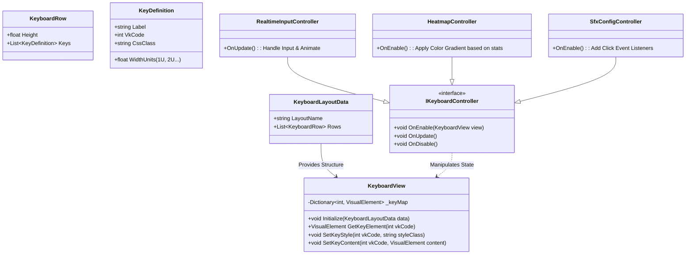

# Extensible Keyboard Layout System (EKLS) Design

## 1. 개요 및 목적

단순히 실시간 입력을 보여주는 것을 넘어, **통계(Heatmap)**, **설정(Config)**, **사운드 매핑** 등 다양한 컨텍스트에서 재사용 가능한 **통합 키보드 시각화 시스템**을 설계함.

### 핵심 요구사항

1. **재사용성 (Reusability)**: 하나의 레이아웃 렌더러로 '입력 보기', '통계 보기', '설정 하기' 모드를 모두 지원해야 함.
2. **확장성 (Extensibility)**: 104키, 87키(TKL), 60% 등 다양한 물리적 레이아웃 데이터를 쉽게 정의하고 교체할 수 있어야 함.
3. **데이터 주도 (Data-Driven)**: 키의 위치, 크기, 라벨, 매핑 코드는 코드가 아닌 데이터(ScriptableObject/JSON)로 관리됨.

---

## 2. 아키텍처 설계

시스템을 **Data**, **View**, **Controller**의 3계층으로 분리하여 책임을 명확히 함.



### 2.1. Data Layer (`KeyboardLayoutData`)

물리적 키보드의 구조를 정의하는 정적 데이터. `ScriptableObject`로 구현하여 에디터에서 관리.

- **Unit System**: 키 크기는 픽셀이 아닌 `U` 단위(1U = 일반 키 크기)로 정의하여 해상도 대응력 확보.
- **구조**:
  - `Rows`: 키보드의 가로 줄 리스트.
  - `Keys`: 각 줄에 포함된 키 정보 (`VkCode`, `Width`, `Label`).

### 2.2. View Layer (`KeyboardView`)

순수하게 **렌더링**과 **요소 접근**만을 담당하는 UIToolkit 컴포넌트(`VisualElement`).

- **책임**:
  - `KeyboardLayoutData`를 받아 Flexbox 기반의 UI 생성.
  - `VkCode`를 키로 하는 `Dictionary<int, VisualElement>` 캐싱.
  - 외부(Controller)에서 특정 키의 스타일이나 내용을 변경할 수 있는 API 제공.
- **스타일링**: USS를 활용하여 키의 기본 모양(Base), 눌림(Active), 히트맵(Heatmap) 등 상태별 외형 정의.

### 2.3. Controller Layer (`IKeyboardController`)

키보드 뷰를 **어떻게 사용할 것인가**를 정의하는 로직. 상황에 따라 교체 가능.

1. **`RealtimeInputController` (Companion Mode)**
    - 실시간 `KeyboardModule` 이벤트를 구독.
    - 키가 눌리면 `KeyboardView`의 해당 키에 `.active` 클래스 토글.
    - 파티클/셰이더 이펙트 트리거.

2. **`HeatmapController` (Analytics Mode)**
    - `KeyboardStats` 데이터를 조회.
    - 각 키의 빈도수에 따라 색상 코드(Gradient) 계산.
    - `KeyboardView` 각 키의 `backgroundColor`를 직접 수정.

3. **`ConfigController` (Settings Mode)**
    - 키 클릭 시 설정 팝업(SFX 선택, 매크로 지정 등) 호출.
    - 설정된 상태(예: 커스텀 SFX 적용됨)를 아이콘으로 키 위에 표시.

---

## 3. 구현 상세 계획

### 3.1. 디렉토리 구조

```
KarmoToys/
├── Features/
│   └── Keyboard/
│       ├── Data/           # ScriptableObjects (Layout Definitions)
│       ├── View/           # KeyboardView.cs, KeyboardStyles.uss
│       └── Controllers/    # Realtime, Heatmap, Config logic
```

### 3.2. 데이터 포맷 예시 (JSON/SO)

```json
{
  "layoutName": "ANSI 104",
  "rows": [
    {
      "keys": [
        { "label": "Esc", "vkCode": 27, "width": 1.0 },
        { "label": "F1", "vkCode": 112, "width": 1.0, "spacingLeft": 1.0 }
        // ...
      ]
    },
    {
      "keys": [
        { "label": "~", "vkCode": 192, "width": 1.0 },
        { "label": "1", "vkCode": 49, "width": 1.0 },
        // ...
        { "label": "Backspace", "vkCode": 8, "width": 2.0 }
      ]
    }
  ]
}
```

### 3.3. 확장성 시나리오

- **상황**: 사용자가 TKL(텐키리스) 버전을 원함.
- **대응**: 코드 수정 없이 `KeyboardLayoutData_TKL` 에셋을 생성하고, `KeyboardView`에 주입하면 즉시 레이아웃이 변경됨. 로직(Controller)은 그대로 재사용 가능.

---

## 4. 결론

이 설계는 **"모양(View)"과 "동작(Controller)"의 완벽한 분리**를 핵심으로 함. 이를 통해 키보드 UI를 단순히 입력 보여주기용 장난감이 아니라, 프로젝트 전반에 걸친 **강력한 인터페이스 리소스**로 활용할 수 있음.
